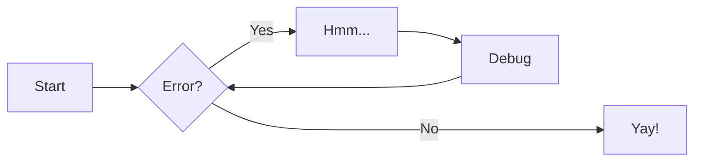
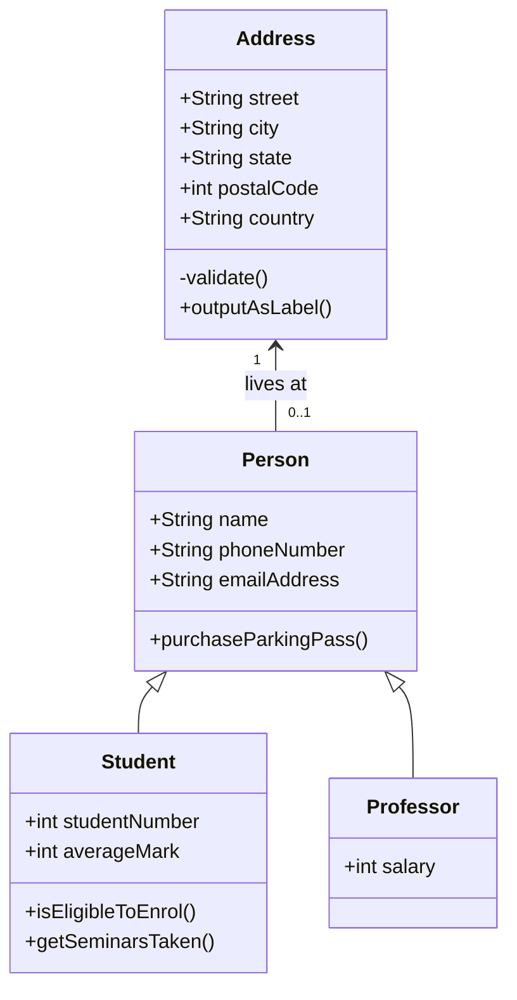
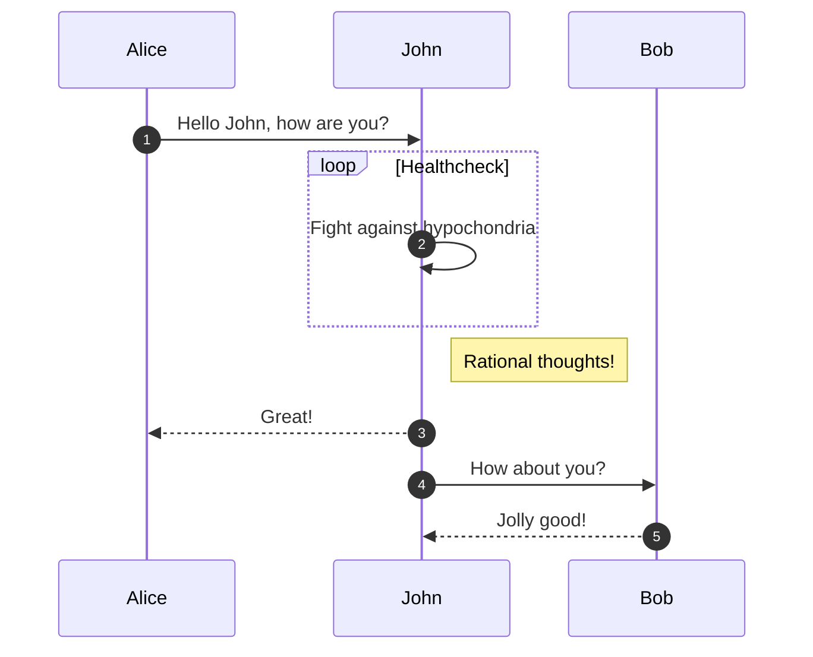

# Recursos

## Formatação em Markdown

### Itálico

Você pode criar texto em itálico usando um asterisco (*) ou um sublinhado (_) antes e depois do texto.

**Por exemplo:**

```
*Este texto está em itálico* ou _Este texto também está em itálico_.
```

**Saída:**

*Este texto está em itálico* ou _Este texto também está em itálico_.

### Negrito

Você pode criar texto em negrito usando dois asteriscos (**) ou dois sublinhados (__) antes e depois do texto.

**Por exemplo:**

```
**Este texto está em negrito** ou __Este texto também está em negrito__.
```

**Saída:**

**Este texto está em negrito** ou __Este texto também está em negrito__.

### Sublinhado

O Markdown não tem suporte nativo para sublinhado. No entanto, você pode usar o HTML para adicionar sublinhado em seu documento.

**Por exemplo:**

```
<u>Este texto está sublinhado</u>
```

**Saída:**

<u>Este texto está sublinhado</u>

### Tópicos

Você pode adicionar títulos e sub-títulos ao seu documento Markdown usando sinais de hash (#). O número de sinais de hash que você usa determina o nível do título.

**Por exemplo:**

```
# Título de nível 1
## Título de nível 2
### Título de nível 3
#### Título de nível 4
##### Título de nível 5
###### Título de nível 6
```

### Lista Ordenadas

Você pode criar listas ordenadas colocando o número 1 seguido de ponto (.) no início da linha.

**Por exemplo:**

```
1. Item 1
1. Item 2
1. Item 3
1. Item 3a
1. Item 3b
```

**Saída:**

1. Item 1
1. Item 2
1. Item 3
1. Item 3a
1. Item 3b

### Lista Não Ordenadas

Você pode criar listas não ordenadas colocando um asterisco (*) no início da linha. 

**Por exemplo:**

```
* Item 1
* Item 2
* Item 2a
* Item 2b
```

**Saída:**

* Item 1
* Item 2
* Item 2a
* Item 2b

### Links Externos

Você pode adicionar links externos ao seu documento Markdown usando colchetes ([]), seguidos de parênteses (()), que contêm a URL do link.

**Por exemplo:**

```
[Link para o Google](https://www.google.com)
```

**Saída:**

[Link para o Google](https://www.google.com)

### Links Internos

Você pode adicionar links internos ao seu documento Markdown usando colchetes ([]), seguidos de parênteses (()), que contêm a URL do link. A URL deve vir precedida de `#` seguido do nome do título da seção trocando os espaços pelo hífen `-`.

**Por exemplo:**

```
[link listas ordenadas](#lista-ordenadas)
```

**Saída:**

[link listas ordenadas](#lista-ordenadas)

### Imagens Externas

Você pode adicionar imagens externas ao seu documento Markdown usando um ponto de exclamação (!) seguido de colchetes ([]), que contêm a descrição da imagem, seguido de parênteses (()), que contêm a URL da imagem.

**Por exemplo:**

```

```

**Saída:**


### Imagens Internas

Você pode adicionar imagens internas ao seu documento Markdown usando um ponto de exclamação (!) seguido de colchetes ([]), que contêm a descrição da imagem, seguido de parênteses (()), que contêm a URL local da imagem.

**Por exemplo:**

```

```

**Saída:**


### Tabelas

Você pode criar uma tabela utilizando de forma estrutura o símbolo pipe (|) como separador das células.

**Por exemplo:**

```
| Coluna A  | Coluna B |
| --------- |----------|
| Valor 1   | Valor X  |
| Valor 2   | Valor Y  |
| Valor 3   | Valor Z  |
```

**Saída:**

| Coluna A  | Coluna B |
| --------- |----------|
| Valor 1   | Valor X  |
| Valor 2   | Valor Y  |
| Valor 3   | Valor Z  |


**Por exemplo:** Alinhamento Esquerda

```
| Method      | Description     |
| :---------- | :-------------- |
| `GET`       | Fetch resource  |
| `PUT`       | Update resource |
| `DELETE`    | Delete resource |
```

**Saída:**

| Method      | Description     |
| :---------- | :-------------- |
| `GET`       | Fetch resource  |
| `PUT`       | Update resource |
| `DELETE`    | Delete resource |

**Por exemplo:** Alinhamento Centro

```
| Method      | Description     |
| :---------: | :-------------: |
| `GET`       | Fetch resource  |
| `PUT`       | Update resource |
| `DELETE`    | Delete resource |
```

**Saída:**

| Method      | Description     |
| :---------: | :-------------: |
| `GET`       | Fetch resource  |
| `PUT`       | Update resource |
| `DELETE`    | Delete resource |

**Por exemplo:** Alinhamento Direita

```
| Method      | Description     |
| ----------: | --------------: |
| `GET`       | Fetch resource  |
| `PUT`       | Update resource |
| `DELETE`    | Delete resource |
```

**Saída:**

| Method      | Description     |
| ----------: | --------------: |
| `GET`       | Fetch resource  |
| `PUT`       | Update resource |
| `DELETE`    | Delete resource |

### Citação

Você pode inserir uma citação utilize o símbolo maior (>) no início da linha. 

**Por exemplo:**

```
> Como dito por Steve Jobs:
>
>> "Design é tão simples, quanto difícil. É o que separa o bom do ótimo."
```

**Saída:**

> Como dito por Steve Jobs:
>
>> "Design é tão simples, quanto difícil. É o que separa o bom do ótimo."

### Código em Linha

Você pode criar um código em linha utilizando uma crase ("`") no início e no final do código.

**Por exemplo:**

```
`print("Olá, Mundo!")`
```

**Saída:**

`print("Olá, Mundo!")`

### Blocos de Código

Você pode criar um bloco de código utilizando três crases seguidas ("```") no início e no final do código.

**Por exemplo:**

```
"""
def hello_world():
  print("Hello, World!")

hello_world()
"""
```

**Observação:** trocar no exemplo acima as aspas por crases.

**Saída:**

```
def hello_world():
  print("Hello, World!")

hello_world()
```

## Formatação em MkDocs

### Blocos de Código com Destaque

Os blocos de código são uma parte essencial da documentação técnica do projeto. O Material for MkDocs fornece diferentes maneiras de configurar o realce de sintaxe para blocos de código.

Para isso, é necessário incluir no arquivo `mkdocs.yml` o seguinte conteúdo:

```yaml
markdown_extensions:
  - pymdownx.highlight:
      anchor_linenums: true
      line_spans: __span
      pygments_lang_class: true
  - pymdownx.inlinehilite
  - pymdownx.snippets
  - pymdownx.superfences
```

Para permitir que o código seja facilmente copiado, é necessário incluir no arquivo `mkdocs.yml` o seguinte conteúdo:

```yaml
theme:
  features:
    - content.code.copy
```

Você pode especificar a linguagem utilizada no código-fonte logo após as três primeiras crases (aspas nesse exemplo). Exemplo de código em python.

**Por exemplo:**

```
"""python
def hello_world():
  print("Hello, World!")

hello_world()
"""
```

**Saída:**

```python
def hello_world():
  print("Hello, World!")

hello_world()
```

Algumas das linguagens permitidas de espeficar são: **bash, c, cpp, css, go, html, java, js, markdown, php, properties, python, sql, text, xml, yaml, json**.

Analise os exemplos a seguir.

```
python title="bubble_sort.py"
def bubble_sort(items):
    for i in range(len(items)):
        for j in range(len(items) - 1 - i):
            if items[j] > items[j + 1]:
                items[j], items[j + 1] = items[j + 1], items[j]
```


```python title="bubble_sort.py"
def bubble_sort(items):
    for i in range(len(items)):
        for j in range(len(items) - 1 - i):
            if items[j] > items[j + 1]:
                items[j], items[j + 1] = items[j + 1], items[j]
```

```
python linenums="1"
def bubble_sort(items):
    for i in range(len(items)):
        for j in range(len(items) - 1 - i):
            if items[j] > items[j + 1]:
                items[j], items[j + 1] = items[j + 1], items[j]
```

```python linenums="1"
def bubble_sort(items):
    for i in range(len(items)):
        for j in range(len(items) - 1 - i):
            if items[j] > items[j + 1]:
                items[j], items[j + 1] = items[j + 1], items[j]
```

```
python hl_lines="2 3"
def bubble_sort(items):
    for i in range(len(items)):
        for j in range(len(items) - 1 - i):
            if items[j] > items[j + 1]:
                items[j], items[j + 1] = items[j + 1], items[j]
```

```python hl_lines="2 3"
def bubble_sort(items):
    for i in range(len(items)):
        for j in range(len(items) - 1 - i):
            if items[j] > items[j + 1]:
                items[j], items[j + 1] = items[j + 1], items[j]
```

```
python hl_lines="3-5"
def bubble_sort(items):
    for i in range(len(items)):
        for j in range(len(items) - 1 - i):
            if items[j] > items[j + 1]:
                items[j], items[j + 1] = items[j + 1], items[j]
```

```python hl_lines="3-5"
def bubble_sort(items):
    for i in range(len(items)):
        for j in range(len(items) - 1 - i):
            if items[j] > items[j + 1]:
                items[j], items[j + 1] = items[j + 1], items[j]
```

Para mais informações sobre blocos de código, consulte [https://squidfunk.github.io/mkdocs-material/reference/code-blocks/](https://squidfunk.github.io/mkdocs-material/reference/code-blocks/).

### Advertências

As advertências são uma excelente opção para incluir conteúdo secundário sem interromper significativamente o fluxo do documento. O Material for MkDocs fornece vários tipos diferentes de advertências e permite a inclusão e aninhamento de conteúdo arbitrário.

Para isso é necessário incluir no arquivo `mkdocs.yml` o seguinte conteúdo:

```yaml
markdown_extensions:
  - admonition
  - pymdownx.details
  - pymdownx.superfences
```

Existem vários tipos diferentes de advertências, analise os exemplos abaixo:

**Adevertência: padrão**

```
!!! note

    Lorem ipsum dolor sit amet, consectetur adipiscing elit. Nulla et euismod
    nulla. Curabitur feugiat, tortor non consequat finibus, justo purus auctor
    massa, nec semper lorem quam in massa.
```

!!! note

    Lorem ipsum dolor sit amet, consectetur adipiscing elit. Nulla et euismod
    nulla. Curabitur feugiat, tortor non consequat finibus, justo purus auctor
    massa, nec semper lorem quam in massa.

**Advertência com título**

```
!!! note "Título"

    Lorem ipsum dolor sit amet, consectetur adipiscing elit. Nulla et euismod
    nulla. Curabitur feugiat, tortor non consequat finibus, justo purus auctor
    massa, nec semper lorem quam in massa.
```

!!! note "Título"

    Lorem ipsum dolor sit amet, consectetur adipiscing elit. Nulla et euismod
    nulla. Curabitur feugiat, tortor non consequat finibus, justo purus auctor
    massa, nec semper lorem quam in massa.

**Advertência: sem título**

```
!!! note ""

    Lorem ipsum dolor sit amet, consectetur adipiscing elit. Nulla et euismod
    nulla. Curabitur feugiat, tortor non consequat finibus, justo purus auctor
    massa, nec semper lorem quam in massa.
```

!!! note ""

    Lorem ipsum dolor sit amet, consectetur adipiscing elit. Nulla et euismod
    nulla. Curabitur feugiat, tortor non consequat finibus, justo purus auctor
    massa, nec semper lorem quam in massa.

**Advertência: dobrável**

```
??? note

    Lorem ipsum dolor sit amet, consectetur adipiscing elit. Nulla et euismod
    nulla. Curabitur feugiat, tortor non consequat finibus, justo purus auctor
    massa, nec semper lorem quam in massa.
```

??? note

    Lorem ipsum dolor sit amet, consectetur adipiscing elit. Nulla et euismod
    nulla. Curabitur feugiat, tortor non consequat finibus, justo purus auctor
    massa, nec semper lorem quam in massa.

**Advertência: dobrável inicialmente expandida**

```
???+ note

    Lorem ipsum dolor sit amet, consectetur adipiscing elit. Nulla et euismod
    nulla. Curabitur feugiat, tortor non consequat finibus, justo purus auctor
    massa, nec semper lorem quam in massa.
```

???+ note

    Lorem ipsum dolor sit amet, consectetur adipiscing elit. Nulla et euismod
    nulla. Curabitur feugiat, tortor non consequat finibus, justo purus auctor
    massa, nec semper lorem quam in massa.

**Advertência: tipos possíveis**

Os tipos possíveis de advertências são: abstract, info, tip, success, question, warning, failure, danger, bug, example, quote.

!!! abstract
    Lorem ipsum dolor sit amet, consectetur adipiscing elit. Nulla e euismod nulla. Curabitur feugiat, tortor non consequat finibus, justo purus auctor massa, nec sempre lorem quam in massa.

!!! info
    Lorem ipsum dolor sit amet, consectetur adipiscing elit. Nulla e euismod nulla. Curabitur feugiat, tortor non consequat finibus, justo purus auctor massa, nec sempre lorem quam in massa.

!!! tip
    Lorem ipsum dolor sit amet, consectetur adipiscing elit. Nulla e euismod nulla. Curabitur feugiat, tortor non consequat finibus, justo purus auctor massa, nec sempre lorem quam in massa.

!!! success
    Lorem ipsum dolor sit amet, consectetur adipiscing elit. Nulla e euismod nulla. Curabitur feugiat, tortor non consequat finibus, justo purus auctor massa, nec sempre lorem quam in massa.

!!! question
    Lorem ipsum dolor sit amet, consectetur adipiscing elit. Nulla e euismod nulla. Curabitur feugiat, tortor non consequat finibus, justo purus auctor massa, nec sempre lorem quam in massa.

!!! warning
    Lorem ipsum dolor sit amet, consectetur adipiscing elit. Nulla e euismod nulla. Curabitur feugiat, tortor non consequat finibus, justo purus auctor massa, nec sempre lorem quam in massa.

!!! failure
    Lorem ipsum dolor sit amet, consectetur adipiscing elit. Nulla e euismod nulla. Curabitur feugiat, tortor non consequat finibus, justo purus auctor massa, nec sempre lorem quam in massa.

!!! danger
    Lorem ipsum dolor sit amet, consectetur adipiscing elit. Nulla e euismod nulla. Curabitur feugiat, tortor non consequat finibus, justo purus auctor massa, nec sempre lorem quam in massa.

!!! bug
    Lorem ipsum dolor sit amet, consectetur adipiscing elit. Nulla e euismod nulla. Curabitur feugiat, tortor non consequat finibus, justo purus auctor massa, nec sempre lorem quam in massa.

!!! example
    Lorem ipsum dolor sit amet, consectetur adipiscing elit. Nulla e euismod nulla. Curabitur feugiat, tortor non consequat finibus, justo purus auctor massa, nec sempre lorem quam in massa.

!!! quote
    Lorem ipsum dolor sit amet, consectetur adipiscing elit. Nulla e euismod nulla. Curabitur feugiat, tortor non consequat finibus, justo purus auctor massa, nec sempre lorem quam in massa.

Para mais informações sobre advertências, consulte [https://squidfunk.github.io/mkdocs-material/reference/admonitions/](https://squidfunk.github.io/mkdocs-material/reference/admonitions/).

### Guias de Conteúdo

Às vezes, é desejável agrupar conteúdo alternativo em guias diferentes, por exemplo ao descrever como acessar uma API de diferentes linguagens ou ambientes. O Material for MkDocs permite guias elegantes e funcionais, agrupando blocos de código e outros conteúdos.

Para isso é necessário incluir no arquivo `mkdocs.yml` o seguinte conteúdo:

```yaml
markdown_extensions:
  - pymdownx.superfences
  - pymdownx.tabbed:
      alternate_style: true
```

**Por exemplo:** Guia com código

```
=== "C"

    ``` c
    #include <stdio.h>

    int main(void) {
      printf("Hello world!\n");
      return 0;
    }
    ```

=== "C++"

    ``` c++
    #include <iostream>

    int main(void) {
      std::cout << "Hello world!" << std::endl;
      return 0;
    }
    ```
```

=== "C"

    ``` c
    #include <stdio.h>

    int main(void) {
      printf("Hello world!\n");
      return 0;
    }
    ```

=== "C++"

    ``` c++
    #include <iostream>

    int main(void) {
      std::cout << "Hello world!" << std::endl;
      return 0;
    }
    ```

**Por exemplo:** Guia com listagens

```
=== "Unordered list"

    * Sed sagittis eleifend rutrum
    * Donec vitae suscipit est
    * Nulla tempor lobortis orci

=== "Ordered list"

    1. Sed sagittis eleifend rutrum
    2. Donec vitae suscipit est
    3. Nulla tempor lobortis orci
```

=== "Unordered list"

    * Sed sagittis eleifend rutrum
    * Donec vitae suscipit est
    * Nulla tempor lobortis orci

=== "Ordered list"

    1. Sed sagittis eleifend rutrum
    2. Donec vitae suscipit est
    3. Nulla tempor lobortis orci

**Por exemplo:** Guia com listagens dentro de advertências

```
!!! example

    === "Unordered List"

        ``` markdown
        * Sed sagittis eleifend rutrum
        * Donec vitae suscipit est
        * Nulla tempor lobortis orci
        ```

    === "Ordered List"

        ``` markdown
        1. Sed sagittis eleifend rutrum
        2. Donec vitae suscipit est
        3. Nulla tempor lobortis orci
        ```
```

!!! example

    === "Unordered List"

        ``` markdown
        * Sed sagittis eleifend rutrum
        * Donec vitae suscipit est
        * Nulla tempor lobortis orci
        ```

    === "Ordered List"

        ``` markdown
        1. Sed sagittis eleifend rutrum
        2. Donec vitae suscipit est
        3. Nulla tempor lobortis orci
        ```

Para mais informações sobre guias de conteúdo, consulte [https://squidfunk.github.io/mkdocs-material/reference/content-tabs/](https://squidfunk.github.io/mkdocs-material/reference/content-tabs/).

### Diagramas Mermaid

Os diagramas ajudam a comunicar relações e interconexões complexas entre diferentes componentes técnicos e são um ótimo complemento para a documentação do projeto. O Material for MkDocs integra-se ao Mermaid.js, uma solução muito popular e flexível para desenhar diagramas.

Para isso é necessário incluir no arquivo `mkdocs.yml` o seguinte conteúdo:

```yaml
markdown_extensions:
  - pymdownx.superfences:
      custom_fences:
        - name: mermaid
          class: mermaid
          format: !!python/name:pymdownx.superfences.fence_code_format
```

**Por exemplo:**

**Fluxogramas**

```
mermaid
graph LR
  A[Start] --> B{Error?};
  B -->|Yes| C[Hmm...];
  C --> D[Debug];
  D --> B;
  B ---->|No| E[Yay!];
```



**Diagrama de Classe**

``` 
mermaid
classDiagram
  Person <|-- Student
  Person <|-- Professor
  Person : +String name
  Person : +String phoneNumber
  Person : +String emailAddress
  Person: +purchaseParkingPass()
  Address "1" <-- "0..1" Person:lives at
  class Student{
    +int studentNumber
    +int averageMark
    +isEligibleToEnrol()
    +getSeminarsTaken()
  }
  class Professor{
    +int salary
  }
  class Address{
    +String street
    +String city
    +String state
    +int postalCode
    +String country
    -validate()
    +outputAsLabel()  
  }
```



**Diagrama de Sequência**

```
mermaid
sequenceDiagram
  autonumber
  Alice->>John: Hello John, how are you?
  loop Healthcheck
      John->>John: Fight against hypochondria
  end
  Note right of John: Rational thoughts!
  John-->>Alice: Great!
  John->>Bob: How about you?
  Bob-->>John: Jolly good!
```



Para mais informações sobre diagramas mermaid, consulte [https://squidfunk.github.io/mkdocs-material/reference/diagrams/](https://squidfunk.github.io/mkdocs-material/reference/diagrams/) e [https://mermaid.js.org/intro/](https://mermaid.js.org/intro/).

### Tabelas Ordenáveis

O Material for MkDocs define estilos para tabelas ordenáveis - uma excelente maneira de renderizar dados tabulares na documentação do projeto.

Para isso é necessário incluir no arquivo `mkdocs.yml` o seguinte conteúdo:

```yaml
markdown_extensions:
  - tables

...

extra_javascript:
  - https://unpkg.com/tablesort@5.3.0/dist/tablesort.min.js
  - javascripts/tablesort.js
```

Crie uma pasta chamada `javascripts` dentro da pasta `docs`.

Adicione um arquivo javascript chamado `tablesort.js` na pasta `docs/javascripts/` com o seguinte conteúdo:

```js
document$.subscribe(function() {
  var tables = document.querySelectorAll("article table:not([class])")
  tables.forEach(function(table) {
    new Tablesort(table)
  })
})
```

**Por exemplo:**

| Method      | Description     |
| ----------- | --------------- |
| `GET`       | Fetch resource  |
| `PUT`       | Update resource |
| `DELETE`    | Delete resource |

Para mais informações sobre tabelas, consulte [https://squidfunk.github.io/mkdocs-material/reference/data-tables/](https://squidfunk.github.io/mkdocs-material/reference/data-tables/).

### Abreviações

As abreviações podem ser definidas usando uma sintaxe especial semelhante a URLs e notas de rodapé, começando com um * e imediatamente seguida pelo termo ou sigla a ser associada entre colchetes.

Para isso é necessário incluir no arquivo `mkdocs.yml` o seguinte conteúdo:

```yaml
markdown_extensions:
    - abbr
```

**Por exemplo:**

```
A especificação HTML é mantida pela W3C.

*[HTML]: Hyper Text Markup Language
*[W3C]: World Wide Web Consortium
```

**Saída:**

A especificação HTML é mantida pela W3C.

*[HTML]: Hyper Text Markup Language
*[W3C]: World Wide Web Consortium

Para mais informações sobre abreviações, consulte [https://squidfunk.github.io/mkdocs-material/reference/tooltips/](https://squidfunk.github.io/mkdocs-material/reference/tooltips).
